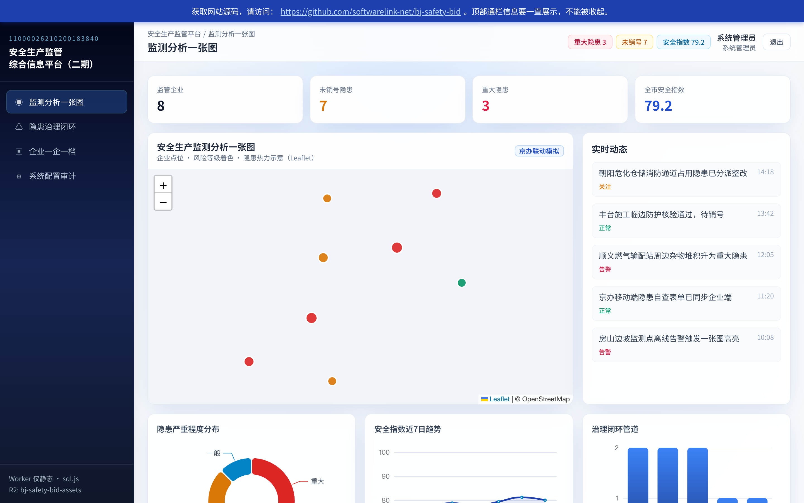

# 北京安全生产监管综合信息平台（二期）原型



## 🚀 部署与访问
- **在线演示地址**：https://bj-safety-bid.softwarelink.net/
- **源码仓库**：https://github.com/softwarelink-net/bj-safety-bid

## 🛠️ 部署与运行说明

### 环境要求
- Node.js >= 18.0.0
- npm >= 9.0.0 或 pnpm >= 8.0.0

### 安装
```bash
git clone https://github.com/softwarelink-net/bj-safety-bid.git
cd bj-safety-bid
npm install
```

### 本地开发
```bash
npm run db:init
npm run dev
```
浏览器访问 `http://localhost:5173`。

### 演示账号
| 角色 | 用户名 | 密码 |
| :--- | :--- | :--- |
| 系统管理员（SuperAdmin） | admin | admin123 |
| 巡查员（Inspector） | inspector01 | pass1234 |
| 企业用户（Enterprise） | ent_user01 | pass1234 |

### 常用脚本
- `npm run build`：生产环境构建
- `npm run lint`：类型检查（vue-tsc）
- `npm run preview`：本地预览生产构建
- `npm run deploy`：构建并上传至 R2（本站前缀）

### 目录结构
```text
├── docs/                 # 文档与预览图
├── public/               # 静态资源（含 SQLite、sitemap）
├── src/                  # 前端源码
│   ├── assets/           # 图片、图标
│   ├── components/       # 可复用 Vue 组件
│   ├── composables/      # Vue 组合式函数
│   ├── layouts/          # AuthLayout、MainLayout
│   ├── router/           # Vue Router 配置
│   ├── stores/           # Pinia 状态
│   ├── utils/            # 工具（sql.js 封装等）
│   ├── views/            # 页面组件
│   └── App.vue
├── worker/               # Cloudflare Worker 源码
├── package.json
└── vite.config.ts
```

## 📢 招标公告全文

### 1. 标题
安全生产监管综合信息平台（二期）项目（第一包：安全生产检查和隐患治理信息子系统软件开发）公开招标公告

### 2. 采购人
北京市应急管理局机关

### 3. 项目编号
11000026210200183840-XM001

### 4. 发布日期
2026-09-04

### 5. 关键词
安全生产监管, 隐患治理, 北京应急管理局, 政府采购, 智慧安监, 京办升级, 一张图

### 6. 摘要
北京市应急管理局启动安全生产监管综合信息平台二期建设，预算 690.5 万元。主要建设内容包括企业隐患自查模块升级、京办 PC/移动端升级、监测分析“一张图”、安全指数测算及企业台账升级等。验收期限：2027 年 3 月 31 日。

### 7. 技术要点
- 对接“京办”生态（PC 端与移动端）
- 隐患监测实时“一张图”GIS 可视化
- AI 辅助人员智能模块
- 与现有垂直业务系统顺畅数据交换

### 8. 创新点
- 以数字化自查推动从被动监管转向主动治理
- 统一企业数据台账，支撑一企一档画像
- 高性能浏览器端 SQLite，支撑外业巡查离线可用

## 免责声明

### 1. 数据来源与合规性

本项目所涉数据信息均采集自互联网公开渠道发布的标讯公示信息。项目开发者严格遵守《中华人民共和国数据安全法》及相关法律法规，确保数据来源合法、公开、可查询。

### 2. 技术实现路径

本项目核心内容系基于国产大语言模型进行算法推演与自动化构造生成，非直接引用或复制原始招标文件。

### 3. 保密承诺

本项目郑重承诺：不涉及、不包含任何国家秘密、商业秘密或未公开的敏感信息。所有生成内容均基于公开数据的逻辑推演。

### 4. 知识产权与巧合声明

鉴于本项目内容均由AI模型基于公开数据推演生成，若生成内容在表述方式、结构逻辑上与任何第三方原始标书文件存在相似之处，**纯属技术推演之巧合，不构成对任何第三方著作权的侵犯或商业秘密的泄露**。本项目不保证生成内容的准确性与完整性，仅供技术研究与学习参考。

### 5. 免责条款

任何单位或个人使用本项目代码及生成内容所产生的一切后果，均由使用者自行承担，项目开发者不承担任何法律责任。
